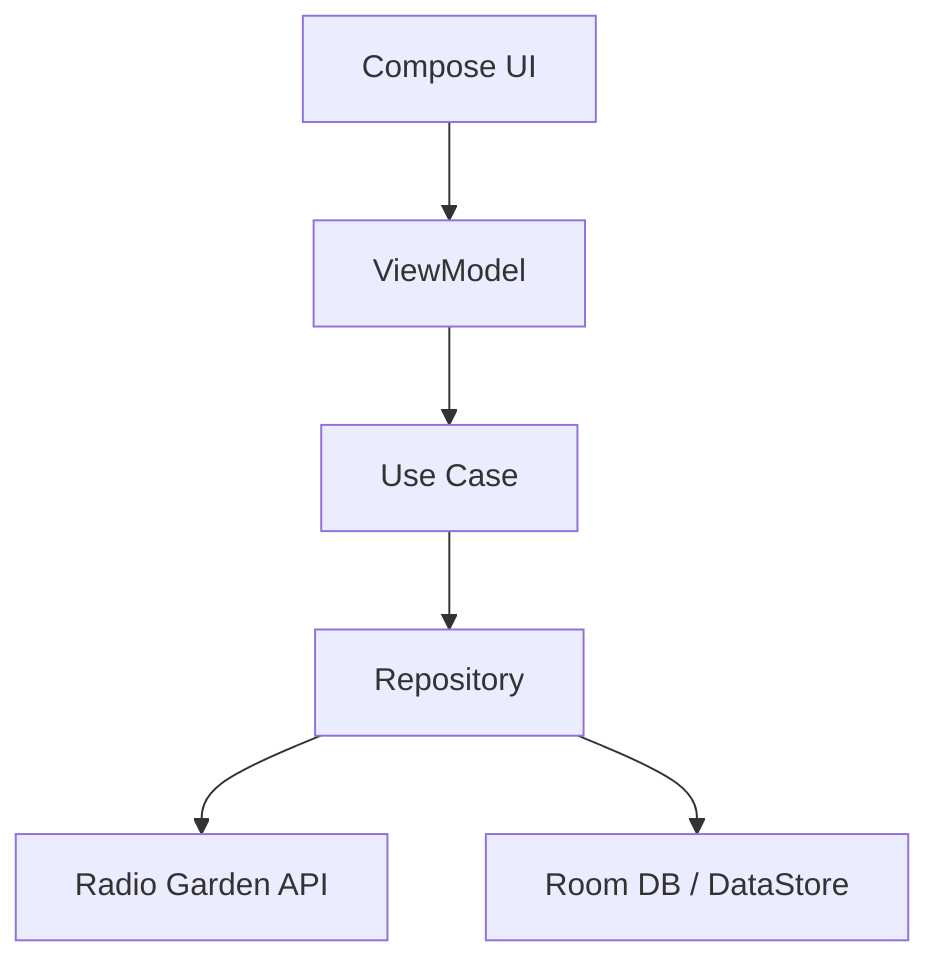

# Myna Bell 🔔📻
> An intelligent Online Radio Alarm Clock designed to combat auditory habituation through dynamic global radio streams and cognitive verification challenges.


## Overview
**Myna Bell** leverages the concept of **Habituasi Auditory** mitigation. Traditional alarms lose effectiveness as the brain learns to ignore static tones. Myna Bell solves this by:
1.  **Dynamic Stimuli**: Streaming random live radio stations from 10,000+ global sources via the Radio Garden API.
2.  **Cognitive Wake-Up**: Requiring a 6-digit TOTP code verification to dismiss the alarm, forcing the brain into an alert state.

## Features
- 🌍 **Global Radio Access**: Browse stations by city (e.g., Jakarta, London, Austin).
- 🔐 **Smart Security**: TOTP-based challenge to turn off the alarm.
- 🎨 **Material 3 Design**: Sleek, dark-themed UI optimized for night/morning use.
- ⚡ **Battery Efficient**: Uses `AlarmManager` for exact timing and `WorkManager` for background maintenance.
- 🔄 **Offline Fallback**: Intelligent switching to local alarm tones if internet connectivity fails.

## Getting Started

### Prerequisites
- Android Studio Iguana or newer.
- JDK 17.
- Android SDK API 34.

### Installation
1.  **Clone the repository**:
    ```bash
    git clone https://github.com/yourusername/Myna-Bell.git
    cd Myna-Bell
    ```
2.  **Open in Android Studio**.
3.  **Sync Gradle Project**.
4.  **Run on Emulator/Device**: Select `app` configuration and press Run.

## Architecture
Myna Bell follows **Modern Android Architecture** principles:
- **UI**: Jetpack Compose (Material 3).
- **Pattern**: MVVM (Model-View-ViewModel) + Clean Architecture.
- **DI**: Hilt.
- **Async**: Coroutines & Flow.
- **Media**: Jetpack Media3 (ExoPlayer).



## Technical Documentation

### API Integration
We interface with the **Radio Garden API** (unofficial) to fetch station data.
- Base URL: `https://radio.garden/api`
- Endpoints: `/ara/content/places`, `/ara/content/page/{id}/channels`

### TOTP Logic
The verification code is generated using standard TOTP algorithms (RFC 6238), ensuring a new code every 30 seconds.

## License
Distributed under the MIT License. See `LICENSE` for more information.

---
*Developed with ❤️ by Antigravity Agent*
